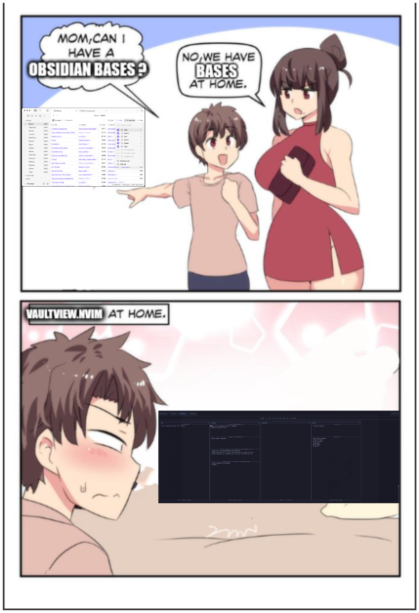
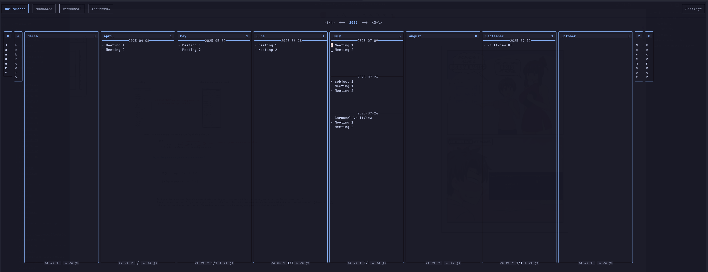
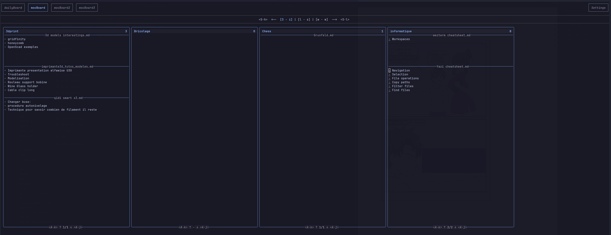
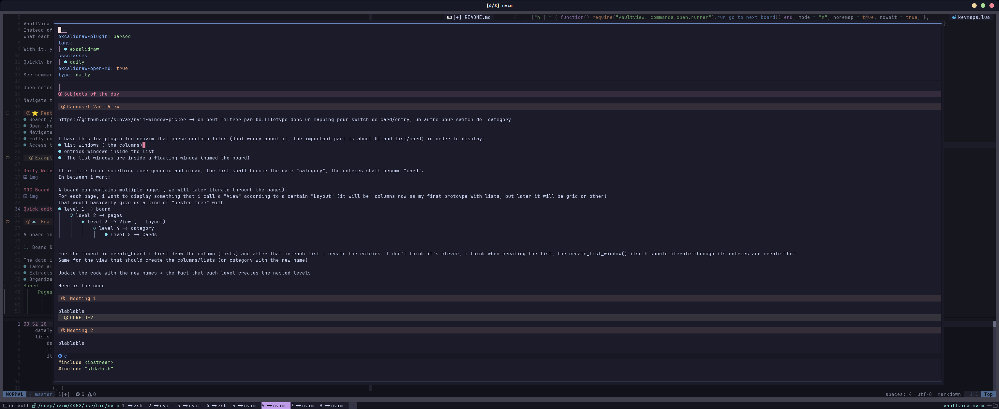

<h1 align="center">vaultview.nvim</h1>

A Neovim plugin to visualize your notes vault in a board-style view — for quick, contextual overviews without relying on a file tree (that is limited for this sort of overview).

---


VaultView allows users to create customizable boards that give a quick, visual overview of their note vault.
Instead of navigating through a file tree, VaultView parses and displays your notes in boards or matrices — giving you an at-a-glance view of what’s inside and what each note contains.

With it, you can:
- Quickly browse your vault in a structured, board-like interface.
- See summaries or key content (like headings, links, or metadata) from your notes.
- Open notes directly in Neovim or Obsidian.
- Navigate the boards fluidly using Vim motions or custom pickers.

<details>
<summary><strong>Can we have Bases at home ?</strong></summary>



</details>

## Table of Contents

- [Features](#-features)
    - [Examples](#examples)
        - [Daily Notes Board (Carousel Layout)](#daily-notes-board-carousel-layout)
        - [Boards of Maps Of Content (Columns Layout)](#boards-of-maps-of-content-columns-layout)
            - [What is a Map Of Content (MOC)?](#what-is-a-map-of-content-moc)
- [How it works](#️-how-it-works)
- [Why this plugin](#-why-this-plugin)
- [External dependencies](#external-dependencies)
- [Installation](#installation)
- [Configuration](#configuration)
    - [Keybinds](#keybinds)
    - [Overwriting Default keybinds](#overwriting-default-keybinds)
    - [Input and Content selectors](#input-and-content-selectors)
    - [Custom parsers](#custom-parsers)
- [Usage](#usage)
- [Keybinds inside VaultView UI](#keybinds-inside-vaultview-ui)
- [Roadmap](#roadmap)
- [Known Issues](#known-issues)


## ⭐ Features
- Search / Parse / Display specific files in a matrix or board view
- Open the corresponding file in Neovim or Obsidian
- Navigate between board entries using Vim motions or custom pickers
- Fully customizable boards — define what subset of your vault each one displays
- Access the files of your vault for quick edit from any Neovim project

### 🪄 Examples

#### Daily Notes Board (Carousel Layout):


#### Boards of Maps Of Content (Columns Layout):


##### What is a Map Of Content (MOC)?

A Map Of Content is a special type of note that serves as a hub or index that gives you an overview of a topic and quickly navigates you to the relevant notes.
A MOC can typically be built within Obsidian by creating a file whose content is a list of links to other notes related to a specific subject.
An optimized workflow to populate MOCs in Obsidian is to use `[[links]]` in notes that relate to the MOC topic and then display dynamically with `Dataview plugin` in the MOC file all notes that link to it.

For example:
```
- Projects.md -> the MOC file
- Project 1.md -> file containing [[Projects]]  (I usually put the link at the top of the file)
- Project 2.md -> file containing [[Projects]]
```

and the dynamically displayed content in Projects.md with Dataview would be (with links that can be followed):


This concept of MOC can be applied to various note organization preferences.

The problem with this is that while you can click on the links in Obsidian, you can’t quickly get an overview of what’s inside each linked note without opening it + you can only display one MOC at a time.

> [!tip]
>With the VaultView plugin, you can create a board that displays all your MOCs at once, along with the headings (or whatever content_selector you prefer) inside each linked note — and navigate it quickly using Vim motions. Plus quickly open the file in either Neovim or Obsidian.


__Quick edit of a file from the board:__


## ⚙️ How it works

The plugin is architectured around the concept of MVC (Model-View-Controller) pattern.

A board in VaultView consists of three main parts:

1. Board Data (The Model)

The data is generated by a parser, which:
- Takes all (or a subset) of your vault’s files => "Input Selection"
- Organizes it into a structured format => "Board Data Structuring"
- Extracts and aggregates relevant information for each entry => "Content Selection"
```
Board
 ├── Pages
 │    ├── Lists (one column/block per list)
 │    │    ├── Entries (one card per entry)
 │    │    │    └── Content (displayed in cards)
```

__Currently Supported Parsers:__
- Daily Note Parser -> Retrieves all daily notes in your vault, sorts them by year/month, and extracts headings for each day.
- MOC Parser -> Finds all your MOC files and, for each one, lists all files linking to it — along with their headings (to display a TOC inside each card).

2. View (The Controller)
The View holds data and states related to one board.
It delegates the rendering of the data to a specific layout.

3. View Layout (The View)

The layout determines how the parsed data is displayed.

__Currently Supported Layouts:__
- Vertical Carousel
- Columns

## 💡 Why this plugin

I love Obsidian — especially for features like the Excalidraw plugin and great table handling.
However, when it comes to navigation with hjkl and text editing, nothing beats Neovim.

What I missed most in Obsidian was a quick way to visualize my vault based on certain criteria — for example:
- Seeing what’s inside all my MOCs (Maps of Content)
- Browsing through all my Daily Notes

Obsidian has Dataview and Bases, but:
- They’re confined within Obsidian’s UI.
- They require a specific query/config language.
- They lack the power of Vim motions.

I actually started thinking about VaultView before Obsidian Bases even existed — and it turned out to be a great way to learn Lua and Neovim plugin development.

## External dependencies
- [ripgrep](https://github.com/BurntSushi/ripgrep?tab=readme-ov-file#installation)


## Installation


- [lazy.nvim](https://github.com/folke/lazy.nvim)

```lua
{
    "fvalenza/vaultview",
    dependencies = { "ColinKennedy/mega.cmdparse", "ColinKennedy/mega.logging", "folke/snacks.nvim" },
}
```

## Configuration


- [lazy.nvim](https://github.com/folke/lazy.nvim)

```lua
return {
	"fvalenza/vaultview.nvim",
	dependencies = { "ColinKennedy/mega.cmdparse", "ColinKennedy/mega.logging", "folke/snacks.nvim" },

	keys = {
		{ "<leader>vv", "<Plug>(VaultView)", mode = "n", desc = "Open VaultView" },
	},

	config = function()

		vim.g.vaultview_configuration = {
			logging = {
				level = "info",
				use_console = false,
				use_file = false,
				output_path = "/tmp/vaultview.log",
			},
			hints = {
				board_navigation = true,
				-- pages_navigation = false, -- TODO: not yet implemented
				-- entry_navigation = false, -- TODO: not yet implemented
			},
            selectors = {
                input = { -- list of custom input selectors. They keys can be used in board definitions
                    exemple_list_files = { -- a comma-separated list of file paths
                        "/path/to/file1.md",
                        "/path/to/file2.md",
                        "/path/to/file3.md",
                    },
                    exemple_lua_function =function(search_path) -- a function that returns a list of file paths from a given search_path
                        return {
                        }
                    end,
                    exemple_shell_command = [=[ your_shell_command ]=], -- Custom shell command to list files
                },
                entry_content= { -- custom content selectors can be defined here and chosen in the board configuration
                    -- shall be grep/awk/rg command lines
                },
            },
            vault = {
                path = "/path/to/your/vault", -- full path to your vault
                name = "myVault", -- name of the Vault as seen by Obsidian. Used to build uri path for Obsidian
            },
			boards = {
				{
					name = "dailyBoard", -- name of the board as printed in the top of UI
                    parser = "daily", -- parser used to retrieve information to display in the view -> currently supported parsers: "daily", "moc"
					viewlayout = "carousel", -- how information is displayed in the view -> currently supported layouts: "carousel", "columns"
                    input_selector = "yyyy-mm-dd.md",-- rule to select files to be included in the board. Can be a built-in selector or a user-defined one
                    subfolder = "vault/0-dailynotes", -- optional subfolder inside vault to limit the scope of the input files
                    content_selector = "h2", -- rule to select content inside each file to be displayed in the view. Can be a built-in selector or a user-defined one
				},
				{
					name = "mocBoard",
					parser = "moc",
					viewlayout = "columns",
                    input_selector = "*.md",
                    subfolder = "vault/1-MOCs",
                    content_selector = "h2",
				},
			},
            initial_board_idx = 1, -- index of the board to be displayed when opening the vaultview. Optional.
		}
	end,
}
```

### Keybinds
Interaction with the VaultView UI is done through actions exposed as `<Plug>` mappings.
This plugin defines default keybinds only inside the VaultView UI (through `ftplugin/vaultview.lua`).

The description of the default keybinds and associated actions/\<Plug\> is as follows:


| Key     | Plug                                | Description                                                                      |
| ------- | ----------------------------------- | -------------------------------------------------------------------------------- |
|         | <Plug>(VaultView)                   | Toggles VaultView UI                                                             |
| q       | <Plug>(VaultViewHide)               | Closes VaultView UI                                                              |
| ?       | <Plug>(VaultViewHelp)               | Open help                                                                        |
| p       | <Plug>(VaultViewPreviousBoard)      | Go to previous board                                                             |
| n       | <Plug>(VaultViewNextBoard)          | Go to next board                                                                 |
| \<S-h\> | <Plug>(VaultViewPreviousPage)       | Go to previous page in current board                                             |
| \<S-l\> | <Plug>(VaultViewNextPage)           | Go to next page in current board                                                 |
| \<M-h\> | <Plug>(VaultViewFirstList)          | Go to first list in current page                                                 |
| h       | <Plug>(VaultViewPreviousList)       | Go to previous list in current page                                              |
| c       | <Plug>(VaultViewCenterList)         | Go to center list in current page                                                |
| l       | <Plug>(VaultViewNextList)           | Go to next list in current page                                                  |
| \<M-l\> | <Plug>(VaultViewLastList)           | Go to last list in current page                                                  |
| gg      | <Plug>(VaultViewFirstEntry)         | Go to first entry in current list (jumps entry's pages)                          |
| k       | <Plug>(VaultViewPreviousEntry)      | Go to previous entry in current list                                             |
| j       | <Plug>(VaultViewNextEntry)          | Go to next entry in current list                                                 |
| G       | <Plug>(VaultViewLastEntry)          | Go to last entry in current list (jumps entry's pages)                           |
| \<A-k\> | <Plug>(VaultViewPreviousPageInList) | Go to previous entry's page in current list                                      |
| \<A-j\> | <Plug>(VaultViewNextPageInList)     | Go to next entry's page in current list                                          |
| o       | <Plug>(VaultViewOpenInNeovim)       | Open file of currently selected entry in Neovim                                  |
| \<CR\>  | <Plug>(VaultViewOpenInObsidian)     | Open file of currently selected entry in Obsidian                                |
| r       | <Plug>(VaultViewRefreshEntry)       | Refresh Content displayed for selected entry                                     |
| R       | <Plug>(VaultViewFastRefresh)        | Refresh Content displayed for all entries (do NOT reparse vault for new entries) |
| 1       | <Plug>(VaultViewBoard1)             | Go To Board 1                                                                    |
| 2       | <Plug>(VaultViewBoard2)             | Go To Board 2                                                                    |
| 3       | <Plug>(VaultViewBoard3)             | Go To Board 3                                                                    |
| 4       | <Plug>(VaultViewBoard4)             | Go To Board 4                                                                    |
| 5       | <Plug>(VaultViewBoard5)             | Go To Board 5                                                                    |
| 6       | <Plug>(VaultViewBoard6)             | Go To Board 6                                                                    |
| 7       | <Plug>(VaultViewBoard7)             | Go To Board 7                                                                    |
| 8       | <Plug>(VaultViewBoard8)             | Go To Board 8                                                                    |
| 9       | <Plug>(VaultViewBoard9)             | Go To Board 9                                                                    |


### Overwriting Default keybinds
To overwrite the default keybinds, the advised way is to create your own `ftplugin/vaultview.lua` (or `ftplugin/vaultview-error.lua` for corrupted boards) in your Neovim configuration folder (e.g. `~/.config/nvim/ftplugin/vaultview.lua`).
In this file, set your preferred keybindings using `vim.keymap.set` with the `{buffer = true}` option.
For example:

```lua
vim.keymap.set("n", "<C-n>", "<Plug>(VaultViewNextBoard)", { buffer = true })
```


or using LazyVim you can put it directly in the `keys` section of the plugin specification:

```lua
{
    "fvalenza/vaultview",
    dependencies = { "ColinKennedy/mega.cmdparse", "ColinKennedy/mega.logging", "folke/snacks.nvim" },
    keys = {
		{ "<leader>vv", "<Plug>(VaultView)", mode = "n", desc = "Open VaultView" },
    },
}
```

> [!warning]
> No default keybind is set to open the VaultView UI and putting a keymap to `<Plug>(VaultView)` in `ftplugin/vaultview.lua` would not work.
> It is expected from the user to set at least this keymap in their Neovim configuration file or to use `:VaultView open` command.

### Input and Content selectors
The plugin comes with some default input and content selectors that can be used in the board configuration.
In the configuration one can specify custom ones for input selector as either : a list of files, a shell command returning a list of files, or a Lua function returning a list of files.
content_selectors only accepts shell commands returning content lines for each entry.
The current default ones are:

```lua
local input_selectors = {
    ["*"] = [[find %q -type f | sort ]], -- all files
    ["*.md"] = [[find %q -type f -name '*.md' | sort ]], -- all markdown files
    ["yyyy-mm-dd.md"] = [[find %q -type f | sort | grep -E '/[0-9]{4}-(0[1-9]|1[0-2])-(0[1-9]|[12][0-9]|3[01])\.md$']], -- all markdown files with name matching yyyy-mm-dd.md
}

local content_selectors = {
    headings = [=[grep -E '^#+[[:space:]]+.+' %q | sed -E 's/^#+[[:space:]]+//' ]=],
    h1 = [=[grep -E '^#[[:space:]]+.+' %q | sed -E 's/^#[[:space:]]+//' ]=],
    h2 = [=[grep -E '^##[[:space:]]+.+' %q | sed -E 's/^##[[:space:]]+//' ]=],
    h3 = [=[grep -E '^###[[:space:]]+.+' %q | sed -E 's/^###[[:space:]]+//' ]=],
    h4 = [=[grep -E '^####[[:space:]]+.+' %q | sed -E 's/^####[[:space:]]+//' ]=],
    h2_awk_noexcalidraw = [=[awk '/^# Excalidraw Data/ { exit } /^##[[:space:]]+.+/ { sub(/^##[[:space:]]+/, ""); print }' %q]=],
    h2_rg_noexcalidraw = [=[rg --until-pattern '^# Excalidraw Data' '^##[[:space:]]+.+$' %q | sed -E 's/^##[[:space:]]+//' ]=],
}
```

### Custom parsers
One can provide in the configuration their own custom parsers by providing a function to the "parser" field of a board configuration.
The function should take as input the vault subtable of the configuration and the board configuration table:

```lua

--- parse a vault folder to create a board data structure depending on the board configuration
---@param vault configuration of the vault {path: string, name: string}
---@param custom_selectors configuration of user custom selectors {input_selectors: table, entry_content_selectors: table}
---@param boardConfig configuration of the board {name:string, parser: string|function, viewlayout: string, subfolder: string, pattern: string}
---@return The BoardDataStructure as expected by a ViewLayout
parser = function(vault_config, custom_selectors, board_config)
    end
```

Warning: As this plugin is still in early development, the API for custom parsers may change in future releases + pattern matching is currently very basic (see TODOs).

## Usage
Once setup and your neovim instance running, you can use the following commands to interact with VaultView.
<!-- plugin/vaultview.lua for details. -->

```vim
:VaultView open
:VaultView close
:VaultView refresh
```

or you can map your preferred keybinding to `<Plug>(VaultView)` to open the main VaultView window.

## Roadmap
See [roadmap](roadmap.md)


